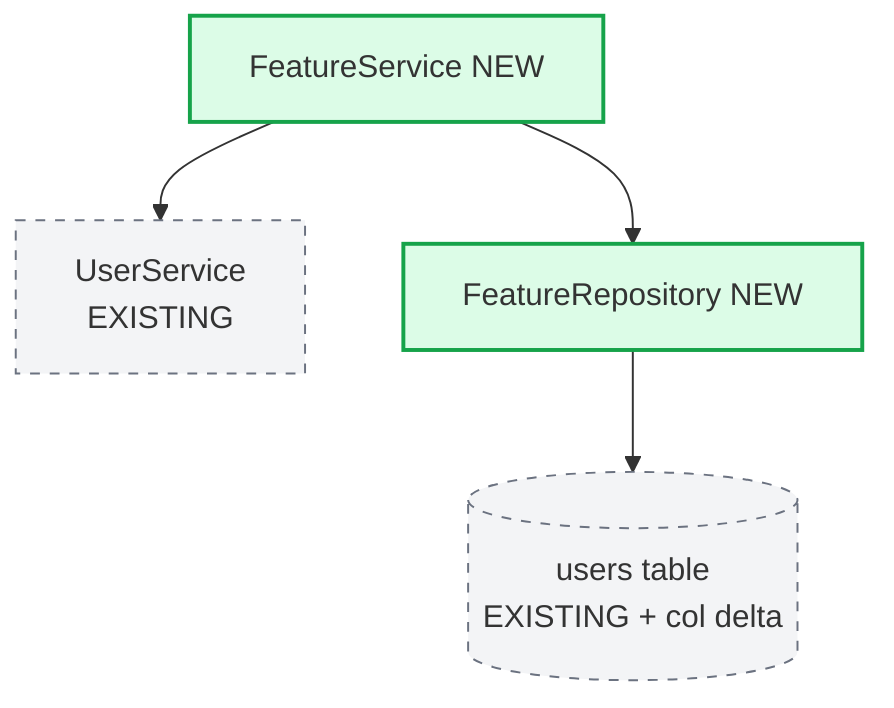
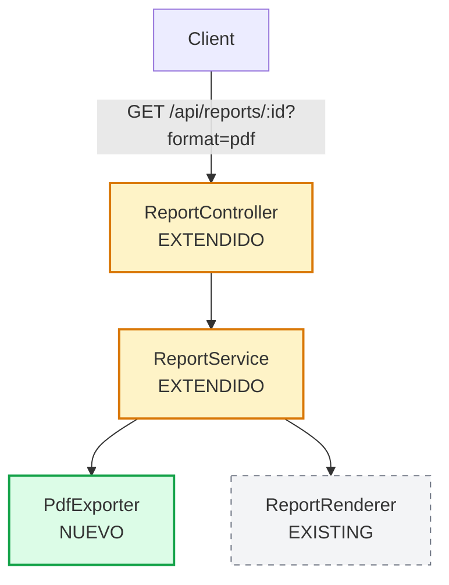

# SDD Design Delta — Constitución

Este skill es la fuente de verdad para producir `docs/features/<feature>/design.md` en el pipeline de **mantenimiento** del framework stark. El subagente `disenador-delta-mantenimiento` consulta este archivo. Cualquier `design.md` producido en este pipeline debe cumplir TODAS las reglas de aquí.

## 1. Propósito del design.md delta

Responde **"¿cómo se implementa el feature del requirements.md sobre la arquitectura existente, sin tocar lo que ya funciona?"**.

Toma cada criterio EARS del `requirements.md` de mantenimiento y lo traduce a decisiones técnicas concretas **acotadas al delta**, respetando la arquitectura, stack, patrones y reglas duras del sistema en producción.

Su función NO es **rediseñar el sistema**. Es **encajar el feature dentro del sistema existente con la menor superficie de cambio posible**.

Regla de oro: **si el design propone cambios en componentes NO listados en la Surface of Contact del requirements, el design está mal — está rediseñando, no extendiendo.**

## 2. Estructura obligatoria (9 secciones)

El archivo SIEMPRE tiene esta estructura, en este orden. Es **paralela** a `sdd-design` para mantener la curva de aprendizaje, pero el contenido de cada sección está acotado al delta.

````markdown
# Design Delta: [Nombre del feature]

> Diseño de mantenimiento sobre `<nombre-sistema>`. Este documento describe el **delta**. La arquitectura existente se considera inmutable y se referencia, no se rediseña.

## 1. Overview del Delta

[Un párrafo. Stack heredado (citarlo, no re-decidirlo), módulo donde
aterriza el feature, naturaleza del cambio (nuevo módulo / extensión de
existente / endpoint nuevo), tamaño estimado.]

## 2. Architecture

### 2.1 Arquitectura Heredada (inmutable)

[Referencia explícita: "El sistema está documentado en docs/BIG_PICTURE.md.
Esta arquitectura NO se modifica." Listar los componentes existentes
relevantes para el feature. NO redibujar el sistema completo.]

### 2.2 Delta Architecture

[Diagrama Mermaid mostrando:
- Componentes nuevos (en estilo destacado)
- Componentes existentes que el delta usa (en estilo `:::existing`,
  conexiones dashed)
- Las flechas indican quién llama a quién, qué módulo nuevo lee/escribe
  en módulo existente]


````

### Componentes del delta

- **FeatureService (nuevo)**: responsabilidad. NO hace X, NO hace Y.
- **FeatureRepository (nuevo)**: responsabilidad. NO hace X.

### Componentes existentes que el delta usa (sin modificar)

- **UserService**: solo se invoca `getById(uuid)`. Sin cambio en su implementación.

### Componentes existentes que el delta modifica

- **users (tabla)**: agrega columna `feature_flag boolean DEFAULT false`. Sin cambio en columnas existentes.

## 3. Data Model Delta

[Solo entidades nuevas o modificaciones a existentes. Si modifica una
tabla existente, mostrar el ALTER explícito y declarar qué NO cambia
de esa tabla.]

```
users (existente — solo se agrega columna)
  ALTER TABLE users ADD COLUMN feature_flag boolean NOT NULL DEFAULT false;
  -- resto de columnas y constraints sin cambios

feature_log (nueva)
  id     uuid    PK,
  user_id uuid   FK → users(id) ON DELETE CASCADE,
  event  text    NOT NULL,
  ts     timestamptz NOT NULL DEFAULT now()
```

## 4. Interface Contracts Delta

[Solo endpoints/funciones nuevos o modificados. Para endpoints existentes
que se extienden, indicar explícitamente qué se agrega Y qué se mantiene.]

### Endpoints nuevos

```
POST /api/feature
  Request: { user_id: uuid, payload: { ... } }
  Response: 201 { id: uuid, ts: ISO8601 }
  Errors:
    400 "INVALID_PAYLOAD"
    403 "FORBIDDEN"
    404 "USER_NOT_FOUND"
```

### Endpoints existentes extendidos

```
GET /api/users/:id  (existente, extendido)
  Cambio: query param opcional `?include=feature_flag`
  - Sin `?include`: comportamiento igual a hoy (invariante I.1)
  - Con `?include=feature_flag`: agrega campo `feature_flag` en response
  Errors: sin cambios respecto a comportamiento actual
```

## 5. Technical Decisions (ADRs del delta)

[Solo ADRs para decisiones técnicas NUEVAS del feature. Si una decisión
existente (stack, patrón) se reutiliza, citarla brevemente — no
re-fundamentarla.]

### ADR-D001: [Título corto]

- **Decisión**: [...]
- **Contexto**: [Por qué surge esta decisión en el contexto del delta.
  Citar restricciones del sistema existente si aplican.]
- **Consecuencias positivas**: [...]
- **Consecuencias negativas**: [...] (tan importantes como las positivas)

### Decisiones heredadas que se mantienen

- Stack: heredado del sistema (Spring Boot 3.x + PostgreSQL 15 + React 18). Sin cambio.
- Patrón de acceso a datos: heredado (Repository pattern via Spring Data JPA). El módulo nuevo lo respeta.
- Error handling: heredado (`@ControllerAdvice` global con error codes tipados). El módulo nuevo se integra con él.

## 6. Critical Flows Afectados

[Diagramas de secuencia SOLO para flujos del feature que tocan
componentes existentes. NO redibujar flujos existentes que no
participan del delta.]

```mermaid
sequenceDiagram
    Actor->>NewController: POST /api/feature
    NewController->>NewService: process(payload)
    NewService->>ExistingUserService: getById(user_id)
    ExistingUserService-->>NewService: User
    NewService->>NewRepo: persist(...)
    NewRepo-->>NewService: ok
    NewService-->>NewController: result
    NewController-->>Actor: 201
```

### Coexistencia con flujos existentes

[Por cada punto de la Surface of Contact con riesgo medio/alto,
declarar explícitamente cómo el delta coexiste sin romper:]

- **`UserService.getById`**: el delta solo invoca, no modifica. Tests existentes (`UserServiceTest`) siguen aplicando.
- **Tabla `users`**: ALTER agrega columna NOT NULL con DEFAULT, **compatible con código existente** (lecturas existentes ignoran la nueva columna).

## 7. Error & Edge Case Strategy del Delta

[Solo manejo de errores nuevos del feature. Integración explícita con
el manejo de errores existente.]

- Errores nuevos del delta están en el `ControllerAdvice` global (heredado).
- Validación cliente + servidor (patrón heredado).
- Si el componente existente falla (ej. `UserService` lanza), el delta propaga el error sin alterar el contrato existente.

## 8. Testing Strategy (delta + regresión)

### Tests del delta

[Mapeo criterio EARS del delta → tipo de test (unit / integration / E2E).]

### Tests de regresión sobre invariantes

[Por CADA invariante de `requirements.md`, declarar el test que la
valida. Si la invariante no tiene test existente, declarar el test
nuevo a crear como "test de blindaje" antes de tocar el módulo.]

| Invariante | Test que la valida | ¿Existe hoy? |
|---|---|---|
| I.1 | `ReportControllerTest.testJsonShapeUnchanged` | Sí |
| I.2 | `ReportRendererTest.testHtmlRenderUnchanged` | Sí |
| I.3 | `RoleGuardTest.testReportAccessByRole` | **NO — crear antes de modificar `auth/`** |

## 9. Traceability

[Tabla obligatoria, doble: criterios EARS del delta + invariantes
preservadas, cada uno con componente que lo implementa/preserva
y test que lo valida.]

### Criterios del delta

| Requirement | EARS Criterion | Component | Test |
|---|---|---|---|
| Req 1 | 1.1 | FeatureService | FeatureServiceTest.testHappyPath |
| Req 1 | 1.2 | PdfGenerator | PdfGeneratorTest.testHeaderFooter |

### Invariantes preservadas

| Invariante | Component (existente) | Test de regresión |
|---|---|---|
| I.1 | ReportController | ReportControllerTest.testJsonShapeUnchanged |
| I.2 | ReportRenderer | ReportRendererTest.testHtmlRenderUnchanged |
| I.3 | RoleGuard | RoleGuardTest.testReportAccessByRole (nuevo) |

```

## 3. Las dos reglas absolutas

### Regla 1: CERO código de implementación

- Pseudocódigo de alto nivel para algoritmos complejos: ✅ permitido
- Schemas de datos en notación SQL-like: ✅ permitido
- Firmas de tipos / interfaces / contratos: ✅ permitido
- Mermaid: ✅ permitido
- Funciones completas en Python/Java/JS/TS: ❌ PROHIBIDO

### Regla 2: Revisable en una sentada

- Target: **200-500 líneas** (más corto que un design greenfield porque solo describe el delta).
- Hard limit: 600 líneas.
- Si pasa de 600, el feature es demasiado grande para un solo ciclo de mantenimiento. Hay que partirlo en sub-features.

Un humano debe poder leer, entender y aprobar el design completo en 20-30 minutos.

## 4. Reglas de calidad por sección

### Overview del Delta
- Máximo 1 párrafo (4-6 líneas).
- Stack heredado citado con versión (no redecidido).
- Tamaño estimado del delta (líneas de código aproximadas, archivos tocados).

### Architecture
- El diagrama Mermaid usa **estilos distintos** para componentes nuevos vs existentes (verde sólido vs gris dashed, por ejemplo).
- Cada componente nuevo declara qué NO hace.
- Cada componente existente que el delta usa declara qué método/interfaz consume (sin enumerar todo).
- Cada componente existente que el delta modifica declara explícitamente qué se modifica Y qué NO se modifica.

### Data Model Delta
- Si modifica tabla existente: mostrar ALTER explícito.
- Compatibilidad hacia atrás obligatoria: las columnas nuevas con NOT NULL deben tener DEFAULT, salvo justificación explícita.
- Cada FK declara política de cascade.
- Cada índice se justifica.

### Interface Contracts Delta
- Endpoints nuevos: contrato completo (request, response, errores tipados).
- Endpoints extendidos: indicar QUÉ se agrega Y QUÉ se mantiene (invariante explícita en design).
- Errores tipados como enum, integrados con el catálogo de errores existente del sistema.

### ADRs del delta
- Solo para decisiones nuevas. NO redecidir stack, patrones globales, etc.
- Si una decisión nueva contradice una decisión existente del sistema, **alerta crítica al humano** — eso no es mantenimiento, es modernización parcial.
- Cada ADR con consecuencias negativas obligatorias.
- ADRs van numerados `D001`, `D002` (prefijo `D` por "delta") para diferenciar de ADRs históricos del sistema (que pueden estar como `ADR-001` en otra documentación).

### Critical Flows
- Solo flujos del feature que tocan componentes existentes.
- Cada flujo incluye al menos un caso de error.
- Sección "Coexistencia con flujos existentes" obligatoria si hay ≥1 fila de Surface of Contact con riesgo medio o alto.

### Error Strategy del Delta
- Reusar la estrategia de errores del sistema existente (citarla).
- Documentar solo los errores nuevos del feature.
- Si el feature requiere cambiar la estrategia existente, alerta crítica — eso es modernización, no mantenimiento.

### Testing Strategy
- Tabla obligatoria de invariantes → tests de regresión.
- Si una invariante NO tiene test existente, declarar el test nuevo de blindaje (que va al tasks.md como tarea de Regression Shield).
- Cada criterio EARS del delta debe tener al menos un test.

### Traceability
- TABLA DOBLE OBLIGATORIA: criterios del delta + invariantes preservadas.
- Cualquier criterio EARS sin componente = FALTA DISEÑO.
- Cualquier invariante sin test = FALTA BLINDAJE.

## 5. Anti-patrones que matan un design.md delta

- ❌ **Rediseñar arquitectura**: si te encuentras describiendo módulos que no están en Surface of Contact, salir del scope. No es mantenimiento.
- ❌ **Decidir stack de nuevo**: el stack está fijado. Si propones cambiarlo, es modernización, no mantenimiento.
- ❌ **Diagramas que ignoran lo existente**: el Mermaid debe MOSTRAR la frontera entre nuevo y existente. Si no la muestra, el revisor no sabe qué se toca.
- ❌ **ADRs que reabren decisiones existentes**: si un ADR del delta dice "elegimos PostgreSQL", está mal — eso ya estaba decidido. Solo ADRs para decisiones del delta.
- ❌ **Omitir la coexistencia**: si Surface of Contact tiene filas riesgo medio/alto y el design no las trata explícitamente, está incompleto.
- ❌ **Falta de tests de regresión**: la tabla de invariantes → tests es obligatoria. Sin ella, no hay garantía de no-regresión.
- ❌ **Errores narrativos**: "retorna un error apropiado" — tipear como enum.
- ❌ **ADRs sin consecuencias negativas**: misma regla que sdd-design.
- ❌ **Cambios incompatibles hacia atrás** sin justificación explícita y plan de migración.

## 6. Ejemplo: diferencia delta bien vs mal

### MAL

```markdown
## 2. Architecture

### Componentes

- UserService: gestiona usuarios
- AuthService: autenticación
- ReportService: reportes
- PdfExporter: exporta a PDF
- NotificationService: notifica
- AuditService: auditoría
- DatabaseLayer: capa de BD
```

Problemas:
- No distingue qué es nuevo y qué existente.
- Lista componentes que NO están en Surface of Contact (sobre-scope).
- Sin diagrama Mermaid.
- Sin "qué NO hace" por componente.
- Re-describe componentes existentes en lugar de referenciarlos.

### BIEN

```markdown
## 2. Architecture

### 2.1 Arquitectura Heredada (inmutable)

Sistema documentado en `docs/BIG_PICTURE.md`. Para este delta son
relevantes: `ReportController`, `ReportService`, `RoleGuard`. NO se
modifican (excepto donde se indica explícitamente en 2.2).

### 2.2 Delta Architecture



### Componentes del delta

- **PdfExporter (nuevo)**: convierte ReportData → byte[] PDF. NO genera HTML, NO maneja autorización (eso queda en RoleGuard existente).

### Componentes extendidos

- **ReportController**: agrega rama si `?format=pdf`. Comportamiento sin el query param idéntico a hoy (invariante I.1).
- **ReportService**: agrega método `exportToPdf(reportId)`. El método existente `getReport(reportId)` sin cambios.

### Componentes existentes que el delta usa sin modificar

- **ReportRenderer**: solo se invoca su método actual `render(report)`.
- **RoleGuard**: misma regla de autorización aplica al endpoint extendido.
```

## 7. Checklist de auto-validación (OBLIGATORIO antes de cerrar)

### Estructura

- [ ] Existen las 9 secciones, en orden, con nombres exactos.
- [ ] La sección 2 tiene 2.1 Arquitectura Heredada Y 2.2 Delta Architecture.
- [ ] El archivo está entre 200-600 líneas.

### Delta-scope

- [ ] No se rediseña arquitectura existente: todo lo nuevo se justifica desde Surface of Contact del requirements.
- [ ] El diagrama Mermaid distingue visualmente componentes nuevos / modificados / existentes.
- [ ] Cada componente nuevo declara qué NO hace.
- [ ] Cada componente modificado declara explícitamente QUÉ cambia y QUÉ no.

### Coexistencia

- [ ] Cada fila de Surface of Contact con riesgo medio/alto tiene tratamiento explícito en sección 6 (Coexistencia).
- [ ] Cambios en data model son compatibles hacia atrás (NOT NULL con DEFAULT, etc.) o tienen plan de migración documentado.
- [ ] Endpoints extendidos declaran que el comportamiento sin el cambio queda idéntico (refuerzo de invariante).

### ADRs

- [ ] ADRs solo para decisiones NUEVAS del delta.
- [ ] Cada ADR con los 4 campos y consecuencias negativas obligatorias.
- [ ] La sección "Decisiones heredadas que se mantienen" lista lo que NO se redecidió (stack, patrones, error strategy).

### Tests y trazabilidad

- [ ] Tabla de invariantes → tests de regresión completa.
- [ ] Cada invariante sin test existente tiene declarado el test nuevo de blindaje.
- [ ] Tabla de Traceability tiene DOS secciones: criterios del delta + invariantes preservadas.
- [ ] Cada criterio EARS del requirements del delta aparece en Traceability con componente y test.
- [ ] Cada invariante del requirements aparece en Traceability con componente existente y test de regresión.

### Reglas absolutas

- [ ] CERO funciones completas de código.
- [ ] CERO redecisión de stack o patrones globales.
- [ ] Errores tipados como enum, integrados con catálogo existente.
- [ ] Si hay cualquier propuesta que contradiga una decisión existente del sistema, está marcada como **alerta crítica** y requiere validación del humano.

## 8. Cuando el output NO está listo

Si después de la auto-validación queda CUALQUIER ítem sin marcar:

1. **NO entregues el design.md**.
2. Reporta al humano qué ítems fallaron y qué información falta.
3. Itera hasta que el checklist completo esté satisfecho.

Un design.md delta mal hecho rompe producción. Mejor uno corto con `TBD: pendiente de decisión` que uno extenso con decisiones que invaden territorio del sistema existente.
