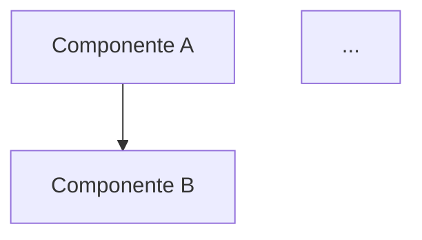

# SDD Design — Constitución

Este skill es la fuente de verdad para producir `docs/design.md` en cualquier proyecto que use este framework. El subagente `disenador-arquitecto` consulta este archivo. Cualquier `design.md` producido debe cumplir TODAS las reglas de aquí.

## 1. Propósito del design.md

Responde **"¿cómo se construye lo que requirements.md pidió?"**. Toma cada criterio EARS del `requirements.md` y lo traduce a decisiones técnicas concretas que el agente codificador (downstream) no tiene que inventar.

Su función no es **describir**, es **decidir y comprometer**. Cada sección amarra una decisión técnica para que el LLM no la tome por su cuenta cuando genere código.

Regla de oro: **si dos personas técnicas leyendo el mismo design.md llegarían a implementaciones diferentes, el design no está completo**.

## 2. Estructura obligatoria (9 secciones)

El archivo SIEMPRE tiene esta estructura, en este orden:

````markdown
# Design: [Nombre del feature o sistema]

## 1. Overview

[Un párrafo. Stack principal, paradigma arquitectónico (monolito,
microservicios, modular monolith, etc.), naturaleza del despliegue
(web, desktop, móvil, híbrido). Da el "marco mental" antes de detalles.]

## 2. Architecture

[Diagrama Mermaid de componentes. Cada componente con su responsabilidad
y QUÉ NO HACE — el "qué no hace" es lo que evita acoplamientos que el
LLM crearía por default.]


````

### Componentes

- **Componente A**: responsabilidad principal. NO hace X, NO hace Y.
- **Componente B**: ...

## 3. Data Model

[Entidades, relaciones, restricciones, índices (incluyendo parciales
que codifican reglas de negocio), políticas de cascade. Aquí se gana
o pierde el partido.]

```
nombre_entidad (
  campo  tipo  PK/FK/NOT NULL/UNIQUE,
  ...
  INDEX (campos) WHERE condición
)
```

## 4. Interface Contracts

[Para cada interacción entre componentes: signatura exacta. APIs REST
con endpoints, métodos, payloads, errores tipados como enum. Funciones
internas con firma de tipos.]

## 5. Technical Decisions (ADRs)

[Architecture Decision Records ligeros. Una entrada por decisión no obvia.]

### ADR-001: [Título corto de la decisión]

- **Decisión**: ...
- **Contexto**: ...
- **Consecuencias positivas**: ...
- **Consecuencias negativas**: ... (tan importantes como las positivas)

## 6. Critical Flows

[Diagramas de secuencia Mermaid solo para los 2-3 flujos más importantes:
dinero, datos sensibles, lógica condicional compleja. NO todos los flujos.]

```mermaid
sequenceDiagram
    Actor->>Sistema: acción
    ...
```

## 7. Error & Edge Case Strategy

[Política de reintentos con backoff, qué se loguea vs qué se muestra al
usuario, estados de degradación, validación cliente Y servidor.]

## 8. Testing Strategy

[Qué se cubre con unit/integration/E2E/property-based. Conexión explícita
criterio EARS ↔ mecanismo de validación.]

## 9. Traceability

[Tabla obligatoria conectando cada criterio EARS del requirements.md
con el componente que lo implementa y el test que lo valida.]

| Requirement | EARS Criterion | Component | Test |
| ----------- | -------------- | --------- | ---- |
| Req 1       | 1.1            | ...       | ...  |
| Req 1       | 1.2            | ...       | ...  |

```

## 3. Las dos reglas absolutas

### Regla 1: CERO código de implementación

- Pseudocódigo de alto nivel para algoritmos complejos: ✅ permitido
- Schemas de datos en notación SQL-like: ✅ permitido
- Firmas de tipos / interfaces / contratos: ✅ permitido
- Mermaid (gráficos y secuencias): ✅ permitido
- **Funciones completas en Python/JS/TS/etc.**: ❌ PROHIBIDO

Si te encuentras escribiendo implementación, ya estás en `tasks.md` o en código directo. El design define el **qué técnico**, no el **cómo línea por línea**.

### Regla 2: Revisable en una sentada

- Target: 300-700 líneas máximo
- Hard limit: 800 líneas
- Si pasa de eso, el feature es demasiado grande. **Hay que partirlo** en sub-features con sus propios designs.

Un humano (cliente técnico, revisor, tú misma) debe poder leer, entender y aprobar el design completo en 30-45 minutos. Si no, el quality gate se rompe porque nadie lo revisa de verdad.

## 4. Reglas de calidad por sección

### Overview
- Máximo 1 párrafo (5-8 líneas).
- Stack concreto con versiones cuando importa: "SQLite 3.45+", no "una base de datos".

### Architecture
- Cada componente tiene UNA responsabilidad principal.
- Cada componente declara qué NO hace (mínimo 1 cosa).
- Las flechas del diagrama tienen dirección clara (quién llama a quién).
- Si hay más de 7-8 componentes en el diagrama de alto nivel, partir en sub-diagramas por dominio.

### Data Model
- Cada FK declara su política de cascade (ON DELETE CASCADE/RESTRICT/SET NULL).
- Índices se justifican (un comentario al lado del índice diciendo POR QUÉ existe).
- Constraints de negocio se codifican en el schema cuando es posible (CHECK, UNIQUE partial, etc.), no se dejan para la lógica de aplicación.

### Interface Contracts
- Errores **tipados como enum** (`"USER_NOT_FOUND"`, `"FIELD_REQUIRED"`), NUNCA strings libres ni "el sistema devuelve un error de validación".
- Cada endpoint/función declara TODOS los códigos de respuesta posibles.
- Tipos son específicos (`uuid`, `ISO8601`, `integer >= 0`), no genéricos (`string`, `number`).

### ADRs
- Formato obligatorio: Decisión / Contexto / Consecuencias (+) y (-).
- Las consecuencias negativas son OBLIGATORIAS. Si no tiene trade-offs, no es una decisión real.
- ADRs solo para decisiones **no obvias**. Elegir HTTPS no es un ADR. Elegir SQLite sobre PostgreSQL sí.

### Critical Flows
- Solo flujos donde el orden y los actores importan: pagos, autenticación, sincronización, transacciones distribuidas, máquinas de estado.
- Cada flujo incluye el camino feliz Y al menos un camino de error.

### Error Strategy
- Para cada categoría de error, decisión explícita: ¿se reintenta? ¿cuántas veces? ¿con qué backoff? ¿se loguea? ¿se muestra al usuario? ¿se degrada el servicio?
- Regla universal: validación en cliente + validación en servidor. El servidor es la verdad.

### Testing Strategy
- Cada criterio EARS del requirements.md debe poder mapearse a al menos un test.
- Niveles claros: qué se cubre con unit, qué con integration, qué con E2E. No mezclar.
- Si se usa property-based testing, especificar las propiedades que se verifican.

### Traceability
- TABLA OBLIGATORIA. No es opcional.
- Filas vacías en columna "Component" = falta diseño.
- Diseño sin fila en la tabla = sobra (o falta un requirement que lo justifique).
- La trazabilidad es bidireccional: del requirement al test pasando por componente.

## 5. Anti-patrones que matan un design.md

- ❌ **Descripción en lugar de decisión**: "El sistema usará una base de datos" vs "El sistema usa SQLite 3.45+ con WAL mode habilitado". El primero no amarra nada.
- ❌ **Diagramas decorativos**: Mermaid bonito pero sin información (cajas con un nombre y flechas sin etiqueta). Cada diagrama debe ENSEÑAR algo.
- ❌ **Implementación disfrazada de diseño**: meter funciones completas con la excusa de "para ilustrar". No. Pseudocódigo si es necesario, código no.
- ❌ **Errores narrativos**: "el sistema devuelve un mensaje de error apropiado". Eso es no decidir nada.
- ❌ **ADRs sin trade-off negativo**: si solo hay consecuencias positivas, la decisión no se pensó.
- ❌ **Falta de traceability**: design sin la tabla final no es auditable.
- ❌ **Mezcla de niveles de abstracción**: diagrama de alto nivel que de pronto entra al detalle de queries SQL. Cada sección a su nivel.

## 6. Ejemplos comparados

### Decisión MAL escrita

```

El sistema usará una base de datos para guardar los expedientes
clínicos. Se elegirá una base de datos apropiada según los
requerimientos.

```

Problema: no decide nada. El LLM downstream va a elegir distinto cada vez.

### Decisión BIEN escrita

```

### ADR-003: SQLite local en lugar de PostgreSQL

- **Decisión**: SQLite 3.45+ con WAL mode habilitado, embebido en la
  aplicación Electron.
- **Contexto**: Aplicación desktop offline-first para consultorios
  dentales con conectividad intermitente. No hay requisito de acceso
  multi-dispositivo simultáneo en v1.
- **Consecuencias positivas**:
  - Cero dependencia de servidor externo.
  - Backup = copiar un archivo.
  - Sin latencia de red para operaciones locales.
- **Consecuencias negativas**:
  - No hay concurrencia multi-usuario en una misma instalación.
  - Sincronización entre dispositivos requiere capa adicional
    (fuera de scope v1, documentado en Open Questions).
  - Migración a Postgres en el futuro requiere capa de abstracción
    en data access que en v1 no se va a construir.

```

## 7. Checklist de auto-validación (OBLIGATORIO antes de cerrar)

Antes de declarar `design.md` terminado, ejecutar mentalmente cada chequeo. Si CUALQUIERA falla, NO entregar — corregir y revalidar.

### Estructura

- [ ] Existen las 9 secciones obligatorias, en orden, con nombre exacto.
- [ ] El archivo está entre 300-800 líneas (si pasa de 800, el feature debe partirse).

### Overview
- [ ] Stack concreto con versiones donde importan.
- [ ] Paradigma arquitectónico declarado.

### Architecture
- [ ] Hay un diagrama Mermaid de componentes.
- [ ] Cada componente tiene responsabilidad principal explícita.
- [ ] Cada componente declara qué NO hace (mínimo 1).
- [ ] Las flechas tienen dirección clara.

### Data Model
- [ ] Cada entidad con campos, tipos, constraints.
- [ ] Cada FK con política de cascade declarada.
- [ ] Cada índice tiene justificación.

### Interface Contracts
- [ ] Todas las APIs externas/internas con firma completa.
- [ ] Errores tipados como enum, nunca strings libres ni descripciones.
- [ ] Todos los códigos de respuesta posibles declarados.

### ADRs
- [ ] Cada ADR tiene los 4 campos (Decisión, Contexto, Consecuencias + y -).
- [ ] Ningún ADR carece de consecuencias negativas.
- [ ] Hay ADRs para todas las decisiones no obvias del proyecto.

### Critical Flows
- [ ] Hay diagramas de secuencia para los flujos críticos.
- [ ] Cada flujo cubre camino feliz Y al menos un camino de error.

### Error Strategy
- [ ] Política de reintentos definida donde aplica.
- [ ] Estrategia de validación cliente Y servidor definida.
- [ ] Estados de degradación definidos.

### Testing Strategy
- [ ] Cada criterio EARS del requirements.md es testeable.
- [ ] Niveles de testing claros (unit/integration/E2E).

### Traceability
- [ ] Existe la tabla de trazabilidad.
- [ ] Cada criterio EARS del requirements.md aparece en la tabla.
- [ ] Ningún componente del design aparece sin justificación en requirements.

### Reglas absolutas

- [ ] CERO funciones completas de código (solo pseudocódigo si es necesario).
- [ ] CERO descripciones narrativas donde debería haber decisiones.
- [ ] CERO adjetivos vagos ("apropiado", "robusto", "escalable") sin definición concreta.

## 8. Cuando el output NO está listo

Si después de la auto-validación queda CUALQUIER ítem sin marcar:

1. **NO entregues el design.md**.
2. Reporta al humano qué ítems fallaron y qué información hace falta.
3. Itera hasta que el checklist completo esté satisfecho.

Mejor entregar un design.md más corto con secciones marcadas como `TBD: pendiente de decisión sobre X` que un design.md que parece completo pero tiene huecos disfrazados.
```
