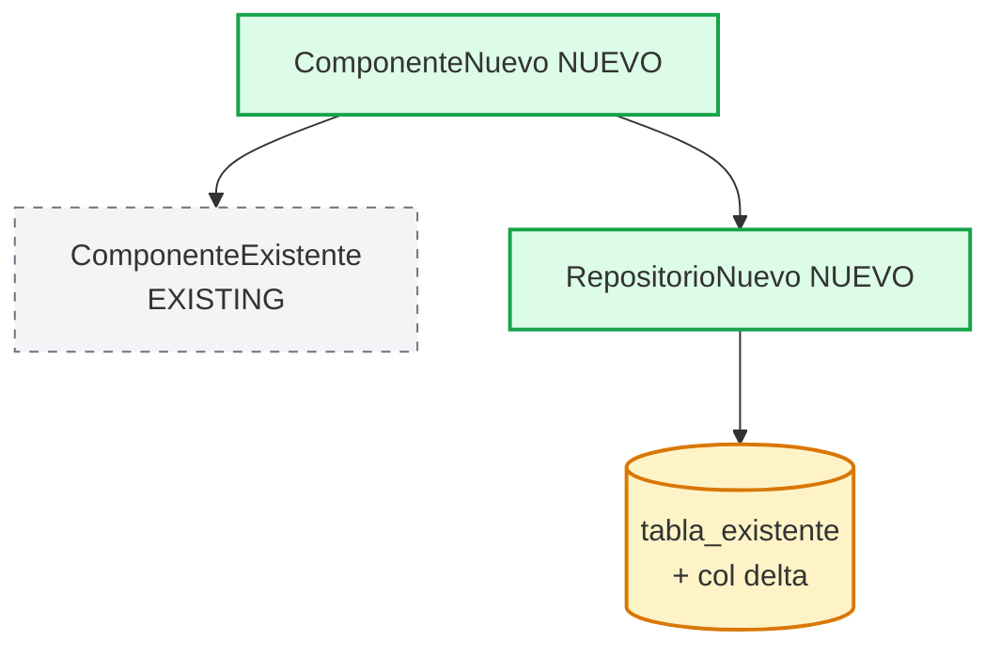

# Design Delta: [Nombre del feature]

> Diseño de mantenimiento sobre `<nombre-sistema>`.
> Describe **el delta**. La arquitectura existente se considera inmutable y se referencia, no se rediseña.
> Generado por `disenador-delta-mantenimiento` siguiendo el skill `sdd-design-delta`.

## 1. Overview del Delta

[Un párrafo, 4-6 líneas:
- Stack heredado citado (no redecidido)
- Módulo donde aterriza el feature
- Naturaleza del cambio (nuevo módulo / extensión de existente / endpoint nuevo)
- Tamaño estimado (archivos tocados, líneas aproximadas)]

## 2. Architecture

### 2.1 Arquitectura Heredada (inmutable)

[Referencia a `docs/BIG_PICTURE.md` (si existe).
Lista de componentes existentes relevantes para el feature.
Marca explícita: "NO se modifica salvo donde se indica en 2.2".]

### 2.2 Delta Architecture



### Componentes del delta

- **ComponenteNuevo (nuevo)**: responsabilidad. NO hace X, NO hace Y.

### Componentes existentes que el delta usa (sin modificar)

- **ComponenteExistente**: solo se invoca `método()`. Sin cambio en implementación.

### Componentes existentes que el delta modifica

- **tabla_existente**: agrega columna `feature_flag boolean DEFAULT false`. Resto de columnas sin cambios.

## 3. Data Model Delta

[Solo entidades nuevas o modificaciones. ALTER explícito si modifica.
Compatibilidad hacia atrás obligatoria.]

```
tabla_existente (existente — solo agrega columna)
  ALTER TABLE tabla_existente ADD COLUMN feature_flag boolean NOT NULL DEFAULT false;
  -- resto sin cambios

tabla_nueva (nueva)
  id     uuid    PK,
  ref_id uuid    FK → tabla_existente(id) ON DELETE CASCADE,
  ...
```

## 4. Interface Contracts Delta

### Endpoints nuevos

```
POST /api/feature
  Request: { ... }
  Response: 201 { id: uuid, ts: ISO8601 }
  Errors: 400 "INVALID_PAYLOAD", 403 "FORBIDDEN", 404 "NOT_FOUND"
```

### Endpoints existentes extendidos

```
GET /api/existente/:id  (extendido)
  Cambio: query param opcional `?include=feature`
  Sin `?include`: comportamiento idéntico a hoy (invariante I.X)
  Con `?include=feature`: agrega campo `feature` en response
```

## 5. Technical Decisions (ADRs del delta)

### ADR-D001: [Título]

- **Decisión**: ...
- **Contexto**: ...
- **Consecuencias positivas**: ...
- **Consecuencias negativas**: ...

### Decisiones heredadas que se mantienen

- Stack: heredado (`...`). Sin cambio.
- Patrón de acceso a datos: heredado (`Repository pattern via ...`). El módulo nuevo lo respeta.
- Error handling: heredado (`...`). El módulo nuevo se integra.

## 6. Critical Flows Afectados

```mermaid
sequenceDiagram
    Actor->>NewController: POST /api/feature
    NewController->>NewService: process(payload)
    NewService->>ExistingService: query(...)
    ExistingService-->>NewService: data
    NewService-->>NewController: result
    NewController-->>Actor: 201
```

### Coexistencia con flujos existentes

[Por cada fila de Surface of Contact con riesgo medio/alto:]

- **`ExistingService.método`**: el delta solo invoca, no modifica. Tests existentes siguen aplicando.
- **`tabla_existente`**: ALTER compatible hacia atrás (DEFAULT explícito).

## 7. Error & Edge Case Strategy del Delta

[Errores nuevos del delta integrados con el catálogo de errores existente.
Validación cliente + servidor (patrón heredado).
Si el componente existente falla, el delta propaga sin alterar contrato existente.]

## 8. Testing Strategy (delta + regresión)

### Tests del delta

[Mapeo criterio EARS → tipo de test (unit / integration / E2E).]

### Tests de regresión sobre invariantes

| Invariante | Test que la valida | ¿Existe hoy? |
|---|---|---|
| I.1 | `...Test.testInvariante1` | Sí |
| I.2 | (sin test) — **crear test de blindaje** | **NO** |

## 9. Traceability

### Criterios del delta

| Requirement | EARS Criterion | Component | Test |
|---|---|---|---|
| Req 1 | 1.1 | NuevoServicio | NuevoServicioTest.testHappyPath |
| Req 1 | 1.2 | NuevoServicio | NuevoServicioTest.testEdgeCase |

### Invariantes preservadas

| Invariante | Component (existente) | Test de regresión |
|---|---|---|
| I.1 | ServicioExistente | ExistenteServicioTest.testInvariante1 |
| I.2 | OtroServicio | TestBlindajeNuevo.testI2 (nuevo) |
