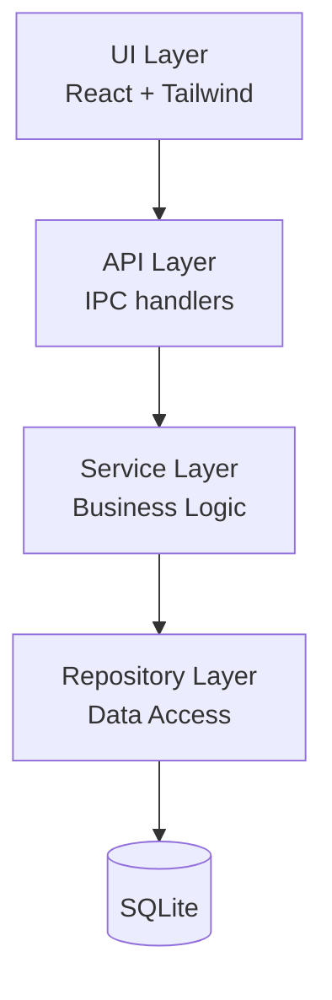

<!--
TEMPLATE: design.md
Framework: stark (Spec-Driven Development)

Reglas absolutas:
- CERO funciones completas de código (solo pseudocódigo si es necesario)
- Cada sección debe DECIDIR, no describir
- Errores tipados como enum, nunca strings libres
- ADRs SIEMPRE con consecuencias negativas
- Tabla de Traceability es obligatoria, no opcional
- Total entre 300-800 líneas; si excede 800, partir el feature

Antes de cerrar este archivo, ejecutar el checklist de auto-validación
definido en .claude/skills/sdd-design/SKILL.md
-->

# Design: [Nombre del feature o sistema]

## 1. Overview

<!--
Un párrafo (5-8 líneas). Stack concreto con versiones, paradigma arquitectónico,
naturaleza del despliegue. Da el marco mental antes de detalles.

Ejemplo:
Sistema desktop offline-first construido con Electron 28 + React 18 + TypeScript 5.
Persistencia local en SQLite 3.45+ con WAL mode. Arquitectura: modular monolith
con capas claras (UI / API interna / Servicios / Repositorios / DB). Despliegue:
binario firmado para macOS y Windows. Sin servidor backend en v1.
-->

```yaml
delivery_strategy: vertical   # vertical (default) | layered
```

<!--
Estrategia de entrega que `descompositor-tareas` lee para ordenar el tasks.md:
- vertical (o sin campo): walking skeleton + rebanadas verticales. Cada slice
  cruza todas las capas de UNA feature y deja software demostrable de punta a punta.
- layered: orden por capa arquitectónica (modelo clásico). SOLO casos legítimos:
  infraestructura pura, migración, o refactor sin UI. Si eliges layered,
  justifica aquí por qué la entrega vertical no aplica.
-->

[Resumen técnico ejecutivo.]

## 2. Architecture

### Diagrama de componentes



### Responsabilidades

<!--
Cada componente: responsabilidad principal Y qué NO hace.
El "qué no hace" evita acoplamientos que el LLM crearía por default.
-->

- **UI Layer**: renderizado de pantallas, captura de input, validación visual. NO contiene lógica de negocio. NO accede directo a la BD.
- **API Layer**: contratos entre UI y servicios. NO contiene lógica de negocio, NO formatea presentación.
- **Service Layer**: lógica de negocio, orquestación, reglas. NO conoce detalles de UI, NO escribe SQL directo.
- **Repository Layer**: acceso a datos, queries, mappers. NO contiene lógica de negocio.

## 3. Data Model

<!--
Entidades, relaciones, restricciones, índices con justificación, políticas de cascade.
Codificar reglas de negocio en el schema cuando sea posible (CHECK, UNIQUE partial).
-->

### Entidad: [nombre]

```
[nombre_entidad] (
  id              uuid PK,
  campo_1         tipo NOT NULL,
  campo_2         tipo,
  foreign_id      uuid FK [otra_tabla](id) ON DELETE [CASCADE|RESTRICT|SET NULL],
  created_at      timestamptz NOT NULL DEFAULT now(),

  INDEX (campo_1) WHERE [condición]    -- justificación del índice
)
```

[Repetir para cada entidad.]

### Relaciones

<!-- Si las relaciones merecen un diagrama ER, agregarlo en Mermaid. -->

## 4. Interface Contracts

<!--
APIs y funciones críticas con firma completa.
Errores tipados como enum, NUNCA strings libres.
-->

### [Nombre del endpoint o función]

```
[METHOD] [path] o [funcion(args)]

Request:
  {
    campo: tipo,
    ...
  }

Response 200:
  {
    campo: tipo,
    ...
  }

Response 400: { error: "FIELD_REQUIRED" | "FIELD_INVALID" }
Response 401: { error: "UNAUTHENTICATED" }
Response 403: { error: "FORBIDDEN_ROLE" }
Response 500: { error: "INTERNAL_ERROR" }
```

## 5. Technical Decisions (ADRs)

<!--
Architecture Decision Records ligeros.
SOLO para decisiones no obvias. Cada ADR con sus 4 campos.
Consecuencias negativas OBLIGATORIAS.
-->

### ADR-001: [Título de la decisión]

- **Decisión**: [Qué se decidió, con especificidad técnica.]
- **Contexto**: [Por qué hubo que decidir esto, qué constraints existían.]
- **Consecuencias positivas**:
  - [Lo bueno 1]
  - [Lo bueno 2]
- **Consecuencias negativas**:
  - [El trade-off 1]
  - [El trade-off 2]

### ADR-002: [siguiente decisión...]

[...]

## 6. Critical Flows

<!--
Solo los 2-3 flujos más importantes. Camino feliz + al menos un camino de error.
NO todos los flujos del sistema.
-->

### Flujo: [nombre del flujo crítico]

```mermaid
sequenceDiagram
    Actor as Usuario
    UI as UI Layer
    API as API Layer
    SVC as Service Layer
    DB as DB

    Actor->>UI: acción
    UI->>API: invocar
    API->>SVC: procesar
    SVC->>DB: query
    DB-->>SVC: resultado
    SVC-->>API: respuesta
    API-->>UI: render
    UI-->>Actor: feedback
```

## 7. Error & Edge Case Strategy

<!--
Para cada categoría de error: ¿se reintenta? ¿cuántas veces? ¿se loguea?
¿se muestra al usuario? ¿se degrada el servicio?

Validación: cliente Y servidor. El servidor es la verdad.
-->

### Política de errores

- **Errores de validación de input**: bloquear acción, mostrar campo afectado con error tipado. No reintentar.
- **Errores de acceso a BD**: 3 reintentos con backoff exponencial (100ms, 400ms, 1.6s). Si fallan, mostrar "DB_UNAVAILABLE" y permitir guardar localmente.
- **Errores no recuperables**: loguear con stack trace, mostrar "INTERNAL_ERROR" al usuario, no exponer detalles técnicos.

### Estados de degradación

- **Sin conexión**: [comportamiento]
- **BD locked**: [comportamiento]
- **Disco lleno**: [comportamiento]

### Validación

- **Cliente**: validación inmediata de tipo y formato. Bloquea submit si falla.
- **Servidor/Servicio**: revalidación completa antes de persistir. Servidor es la verdad.

## 8. Testing Strategy

<!--
Niveles claros: unit / integration / E2E. Conexión criterio EARS ↔ test.
-->

### Cobertura

- **Unit tests**: lógica pura en Service Layer y validadores. Target: >80% coverage en esos módulos.
- **Integration tests**: Repository Layer contra BD real (test fixtures). Service Layer con repos mockeados.
- **E2E tests**: flujos críticos completos vía Playwright. Mínimo: flujos referenciados en sección 6.

### Property-based testing

<!-- Si aplica: qué propiedades se verifican. -->

## 9. Traceability

<!--
TABLA OBLIGATORIA. Cada criterio EARS del requirements.md debe aparecer.
-->

| Requirement | EARS Criterion | Component    | Test      |
| ----------- | -------------- | ------------ | --------- |
| Req 1       | 1.1            | [componente] | [test_id] |
| Req 1       | 1.2            | [componente] | [test_id] |
| Req 2       | 2.1            | [componente] | [test_id] |
| ...         | ...            | ...          | ...       |

<!--
Verificación pre-cierre:
- ¿Cada criterio EARS del requirements.md aparece en esta tabla?
- ¿Cada componente del design aparece justificado en esta tabla?
- ¿Hay filas vacías en columna Component? → FALTA DISEÑO
- ¿Hay diseño que no aparece en la tabla? → SOBRA o falta requirement
-->
